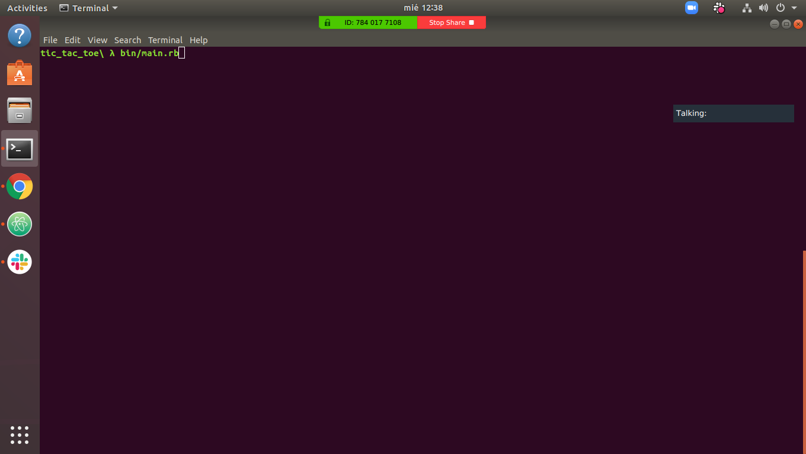
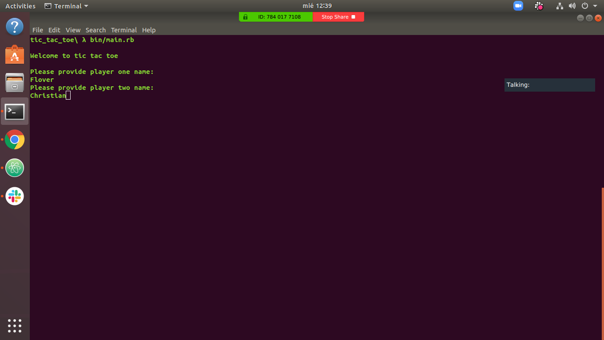
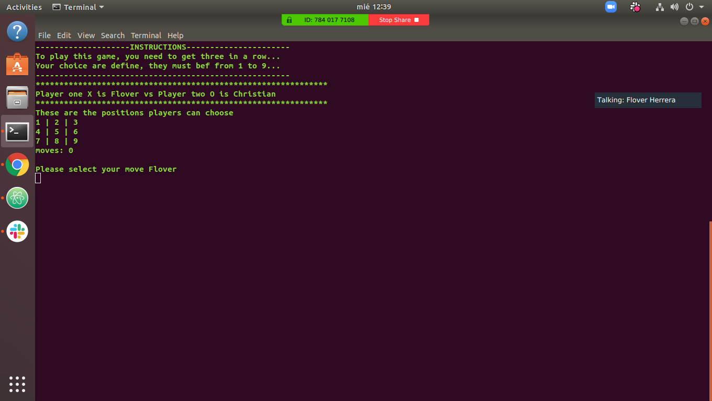
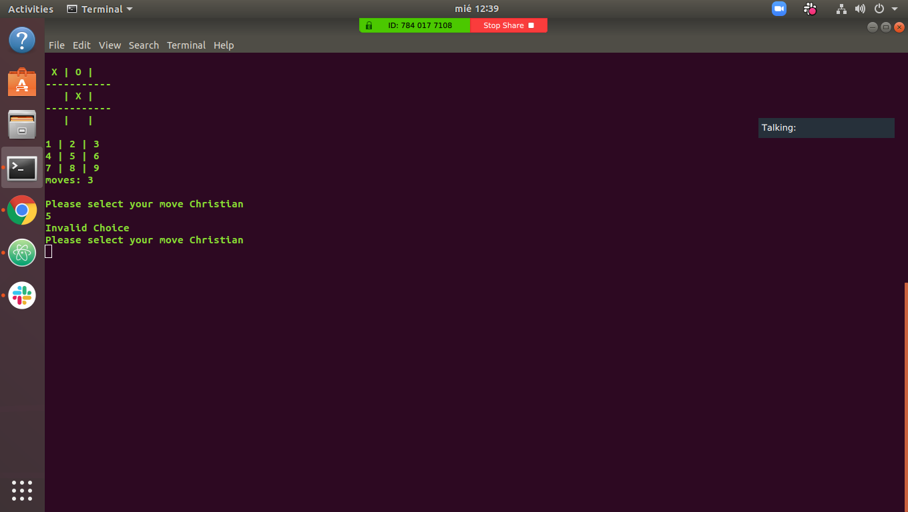
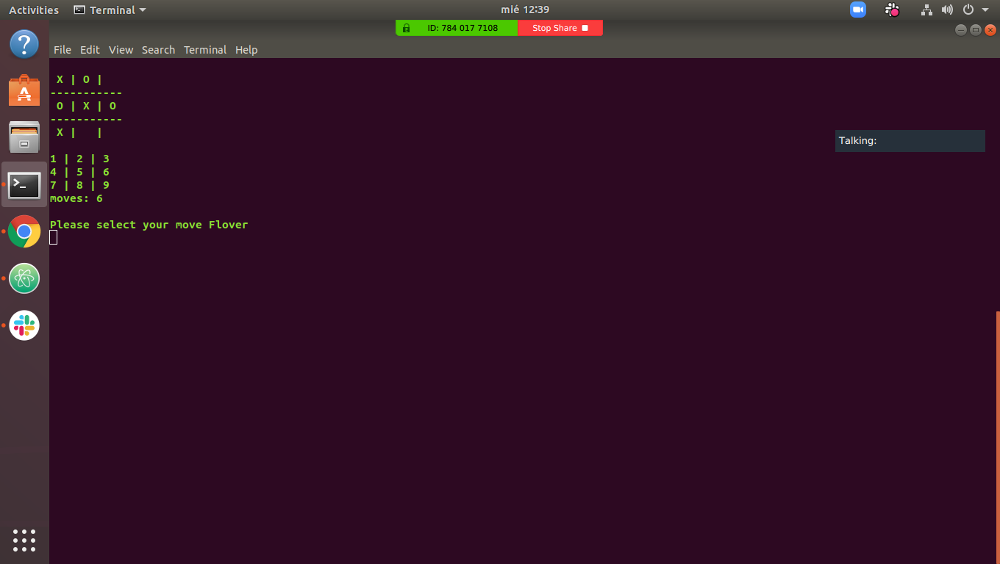
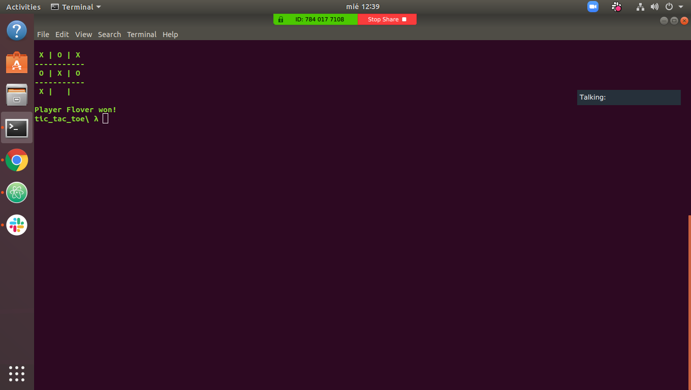

#tic tac toe project

This is the tic tac toe project of the Ruby course of Main curriculum at [Microverse](https://www.microverse.org/) - @microverseinc

* The goal was to create a tic tac toe game
* The project needs to be done in Ruby

#### [Assignment link](https://www.theodinproject.com/courses/ruby-programming/lessons/oop)

#### Instructions
* Execute the file ./bin/main.rb
* Select the name of the players
* A player can only select a space from 1-9
* Player one select move
* Player two select move

#### Rules
* Players cannot move to a space if this has been already taken either by him or the other player, this is an invalid move
* The game goes on until a player creates a line of three horizontal, vertical or diagonal
* There will be a draw if the board gets all of it's spaces filled

#### Screenshots

#### Authors

* [@Flover](https://github.com/flov3rh)

* [@Christian](https://github.com/jcromerohdz)
